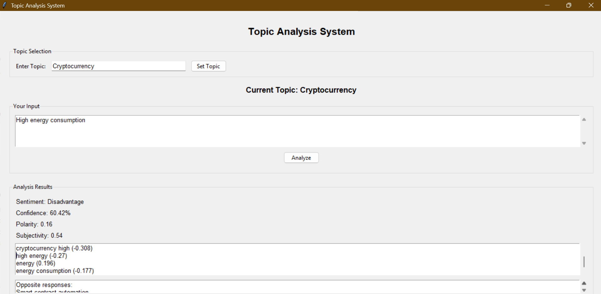

# Topic Analysis System

## 📌 Overview
The Topic Analysis System is a Machine Learning based application that classifies user input as **Advantage** or **Disadvantage** for a given topic.

It also provides:
- Confidence score
- Polarity & Subjectivity analysis
- Influential words
- Opposite perspective examples

## 🚀 Features
- Multi-topic support
- Interactive GUI (Tkinter)
- TF-IDF + Logistic Regression model
- Real-time prediction
- Confidence visualization
- Word count validation

## 🧠 Technologies Used
- Python
- Scikit-learn
- Pandas
- TextBlob
- Tkinter

## 📂 Project Structure

```
topic-analysis-system/
│
├── src/
│   ├── train_model.py
│   ├── predict.py
│
├── data/
│   └── topic_dataset.csv
│
├── models/
│
├── gui.py
├── main.py
├── requirements.txt
└── README.md
```
---

## 👩‍💻 Author

**Sriji Uniyal**  
BCA-AI & DS Third Year Project  

---

## 🖼 Application Preview



## 📌 Project Status

✔ Completed  
✔ GitHub Hosted  
✔ GUI Functional  
✔ Multi-Topic Classification Implemented
